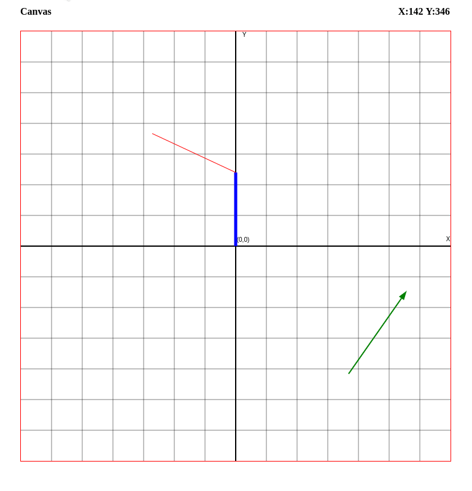
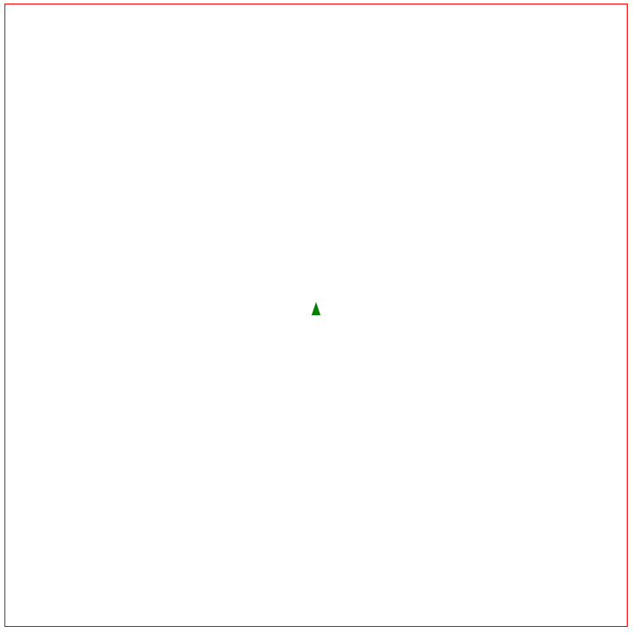
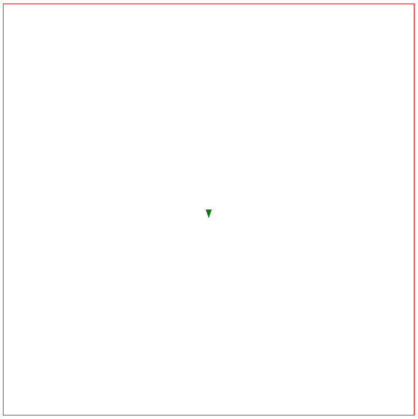
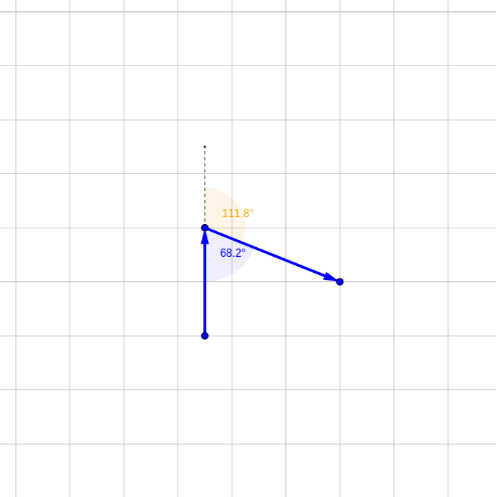
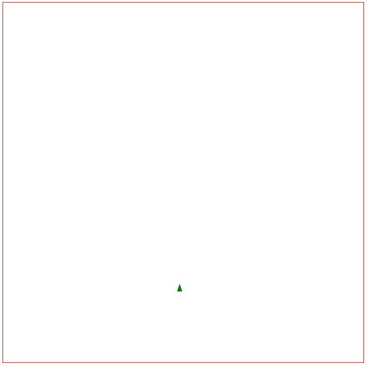
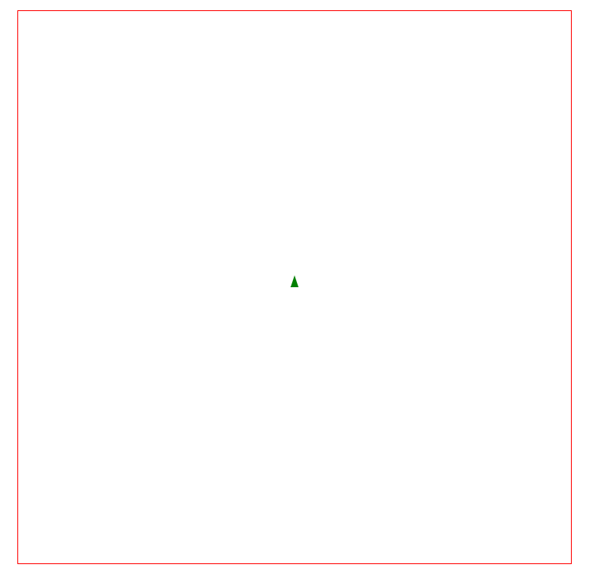

## Intro

js-turtle is an environment to learn/teach programming with JavaScript language. Idea initialy comes from [Seymour Papert](http://www.papert.org/).  
Javascript version of turtle graphycs initialy started by [bjpop](https://github.com/bjpop), than forked and developed by [hanumanum](https://github.com/hanumanum)


## Turtle terms

turtle

\- green triangle

canvas

\- area where turtle moves

coordinates

\- point in canvas, in x y



## Basic functions

### forward()

Turtle moves forward and draw line by given steps, if we write 100 between parentheses, than turtle will move by 100 step.

forward(steps)

**arguments**

int: steps

###### Example 1

```javascript
forward(100)
```

###### Result



### left()

Turtle turns left by given degree, if we write 30 between parentheses, than turtle will turn by 30 degrees.

left(degrees)

**arguments**

int: degrees

###### Example 1

```javascript
left(30)
left(60)
left(90)
                                                
```

###### Result



###### Example 2

```javascript
forward(100)
left(30)
forward(100)
left(50)
                                                    
```

###### Result


###### Geometry

#### Note!

turtle turns by angle, not becomes to an angle provided to function left()

You can play with it [here.](https://www.geogebra.org/m/TzAjZFst)

###### Result



### right()

Same as in left but to right :)

### angle()

Same as in left and right, but the turtle turns to an angle relative to 0 degrees, rather than relative to its current position

### width()

Sets line thickness

width(thickness)

**arguments**

int: thickness

###### Example

```javascript
width(3)
forward(100)
                                                       
width(15)
forward(100)

width(6)
forward(100)
```

###### Result



### goto()

Move to x,y coordinates without drawing a line

goto(x,y)

**arguments**

int: x, int: y

###### Example 1

```javascript
color(255,15,20,1)
goto(-213,128)
forward(100)

color(12,250,65,1)
goto(-7,105)
forward(60)

color(89,100,36,1)
goto(238,-182)
forward(120)
```

###### Result


### colour()

Sets color of next lines

colour(r, g, b, a)

**arguments**

int: r, g, b, a (RGB)  

###### Example

```javascript
color(255,15,20,1)
forward(100)

color(12,250,65,1)
forward(60)

color(89,100,36,1)
forward(120)
```

You can [pick colors from here](https://rgbacolorpicker.com/)

###### Result


### penup() & pendown()

penup() sets to not draw next lines. pendown() removes that setting

penup()

pendown()

**arguments**

no arguments

###### Example

```javascript
color(255,15,20,1)
forward(100)

penup()
forward(60)

pendown()
color(12,250,65,1)
forward(100)
```

###### Result



### clear()

Clear all canvas. Use clear() mostly for animations.

clear()

**arguments**

no arguments

###### Example

```javascript
clear()
```

### reset()

Clear all canvas and move the turtle to its starting position and angle.

### getWidth() / getHeight()

Returns the width/height of the canvas

### setWidth() / setHeight()

Sets the width/height of the canvas

### shape()

Turtle draws a shape, currently supports `"triangle"` (default), `"circle"`, `"square"` and `"turtle"`

### write(string)

Write some text at the turtle position.

### random(low,high)

Returns a random number between `low` and `high`

### hideTurtle() & showTurtle()

Makes the turtle visible or invisible

### wrap(bool)

Turn edge wrapping on/off

### animate(function, ms)

Runs the given callback 'function' every `ms` milliseconds
